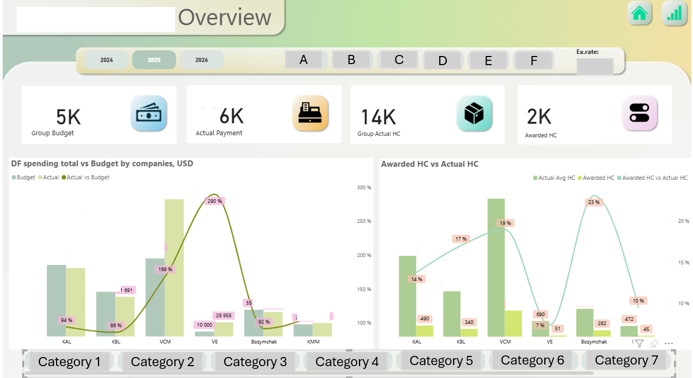
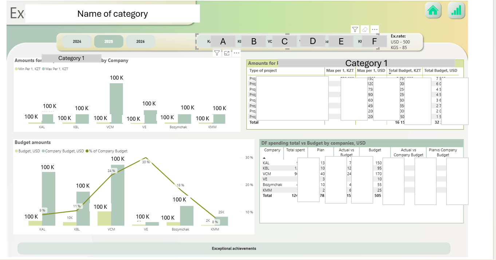

# Korlan Shaketova — HR Analytics Portfolio

**HR Analytics & Compensation specialist** | 14 years in mining HR | KAZ Minerals Group

Skills: `SQL` `Python` `Power BI` `Excel` `Oracle HCM`

---

## Projects

### 1. Turnover Analysis — Q1 2026
**Tools:** Python (pandas, openpyxl), Power BI  
**What:** End-to-end pipeline: raw Oracle export → data cleaning → turnover dashboard  
**Result:** Matched 245/248 termination records (98.8% accuracy) across 6 subsidiaries  
**Code:** [hr_etl_pipeline.py](hr_etl_pipeline.py)  
> *Dashboard screenshots — coming soon*

### 2. Fund A Analysis Dashboard — Power BI
**Tools:** Power BI, Excel  
**What:** Multi-page interactive dashboard for tracking Fund A spending across 6 companies  
**Metrics covered:** Budget vs actual by company, awarded vs actual headcount, category breakdown  
**Screenshots:**  
  

> ⚠️ All figures and company names anonymized for confidentiality purposes

---

## About
14 years in HR at KAZ Minerals Group (VostokTsvetmet).  
Transitioning into People Analytics & HR BI roles.  
Based in Almaty, Kazakhstan.
